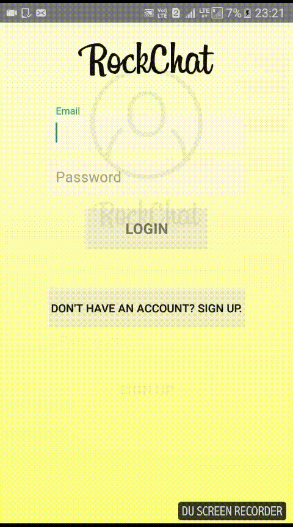
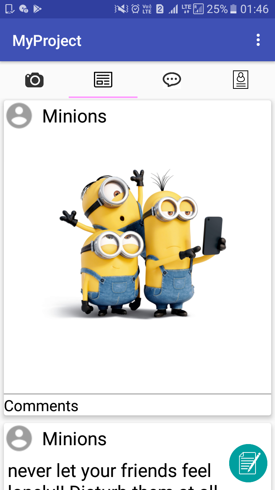
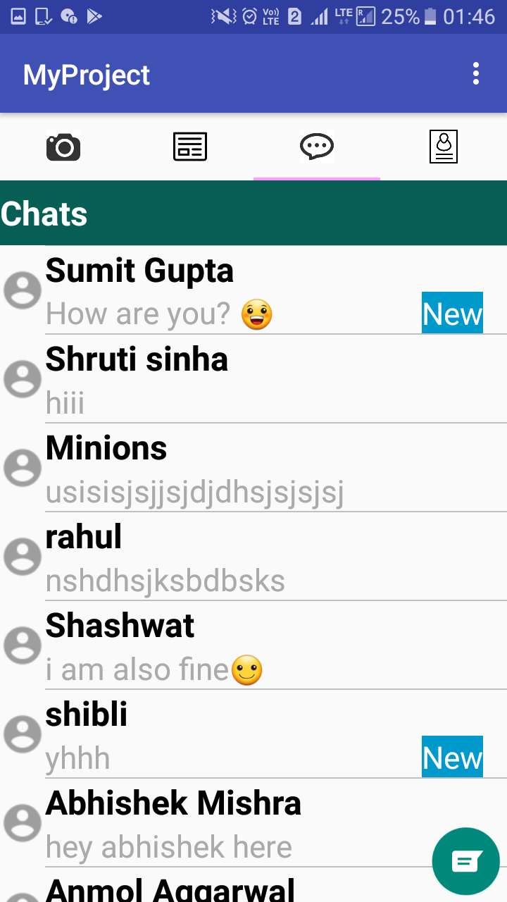
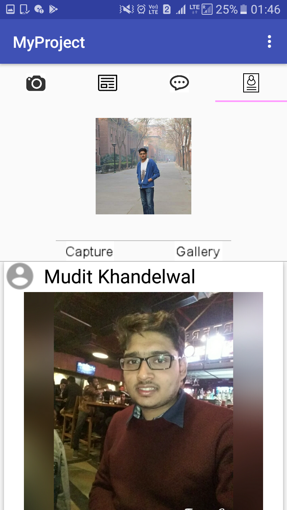
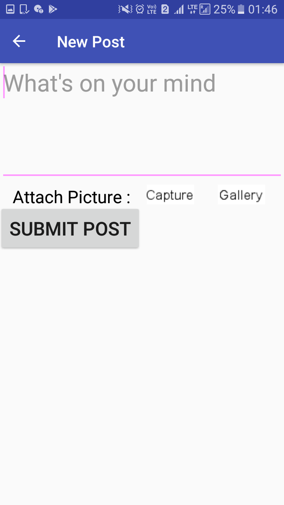
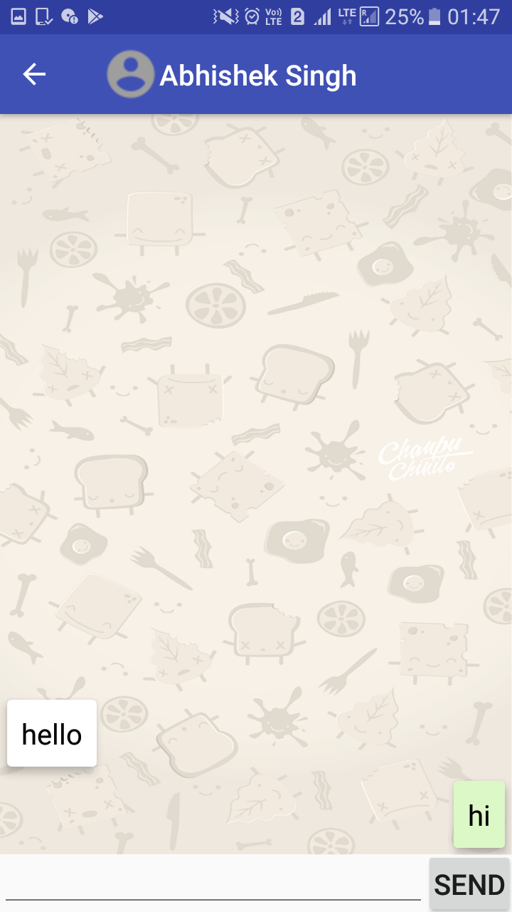
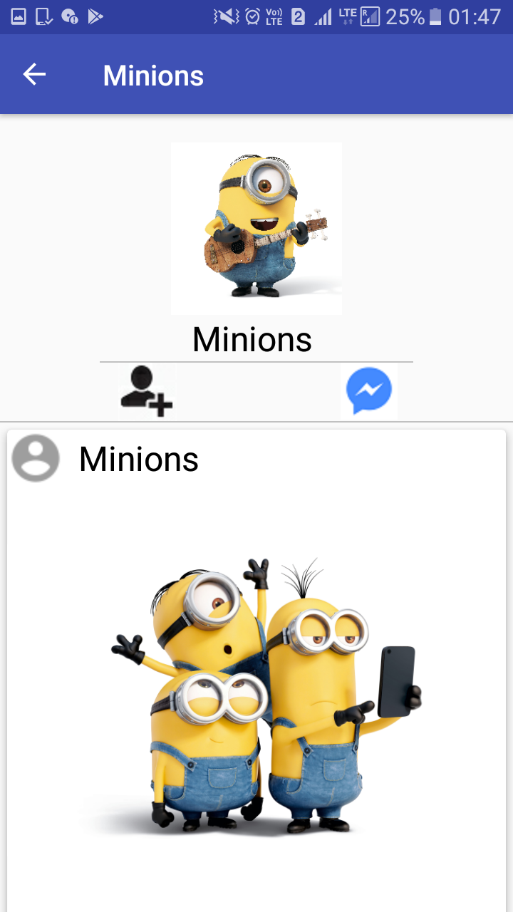

# SocialNetworkingApp

## Introduction

This application is a Social Networking app comprising posts, comments, managing MyProfile,viewing others profile, making friends and chatting with them. It is<b> Firebase-based</b> and uses such <b>Firebase features as the database, storage, and authentication</b>. 

## SignUp and Login Activity

I have used gradient in my login and sign up activity.

### Gradient Effect on Login and Sign Up Activities

## View Pager 
The view pager contains 4 fragment.
 - <b>Home Fragment </b>:
 This shows all the recent posts of all the users on which the user can comment. 
 

 - <b>Chat Fragment </b>:
 This shows all the people with which user has interacted in the past. New messages that has not been read are marked with "New".
 

 - <b>My Profile Fragment </b>:
 This fragment shows profile of the user . The user can change his profile pic and see all of his posts.

 
 - <b>Camera Fragment </b>:
 This fragment directly opens camera and the clicked photo can be shared directly.
 
## New Post Activity

The user can make a new post using this activity . It also has an option of attaching picture along with post.

## One to One Chat Activity 

This activity allows user to chat with the other user.

## Other Users Profile

The user can view the profile of other people by clicking on the other user username.

### Link to the project video

https://drive.google.com/open?id=0B9Bh60dIlqtreFNrLVhtTUFwTUU
